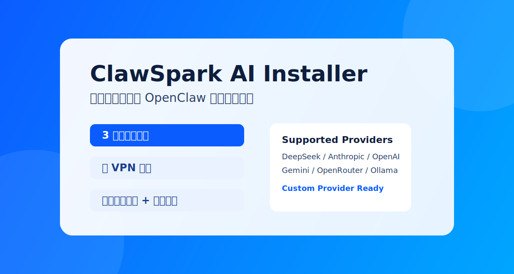

# ClawSpark AI Installer

一个面向中文用户的 OpenClaw 图形化安装器。  
目标是把“复杂安装”变成“3 分钟完成”。

[](https://github.com/Printwhite/ClawSpark-AI/stargazers)
[](https://github.com/Printwhite/ClawSpark-AI/releases)
[](https://github.com/Printwhite/ClawSpark-AI/issues)
[](https://github.com/Printwhite/ClawSpark-AI)



如果这个项目帮你节省了时间，欢迎点一个 Star。  
你的 Star 会直接提升项目在 GitHub 的曝光和持续维护动力。

## 一键下载

- 最新版本发布页：  
  https://github.com/Printwhite/ClawSpark-AI/releases/latest

- Windows 安装包（EXE）：  
  在 Releases 中下载 `ClawSpark-AI-Setup-<version>.exe`

## 项目亮点

- 无 VPN 友好：安装流程内置镜像和重试策略
- 中文向导体验：从环境检测到安装完成全流程中文
- 多模型支持：DeepSeek / Anthropic / OpenAI / Gemini / OpenRouter / Ollama
- 自定义供应商：支持 OpenAI 兼容协议与 Anthropic 协议
- API Key 预校验：减少“装完才发现 key 无效”
- 卸载闭环：支持一键卸载和本地配置清理

## 适用人群

- 第一次接触 OpenClaw 的新手用户
- 不想手动折腾命令行和配置文件的用户
- 需要稳定安装流程的团队内部分发场景

## 3 分钟快速开始

```bash
npm install
npm start
```

安装器完成后，默认控制台地址：

`http://127.0.0.1:18789`

## 本地构建

```bash
# Windows
npm run build:win

# macOS
npm run build:mac

# Linux
npm run build:linux
```

构建产物默认输出到 `dist/` 目录。

## 核心能力清单

- 环境检测：Node.js / npm / 磁盘空间 / 网络可达性
- 模型配置：内置模型 + 自定义模型供应商
- 密钥管理：输入、校验、写入本地 `.env`
- 渠道选择：Web 控制台及常见渠道开关
- 安装日志：实时输出、可重试、可定位问题
- 卸载能力：CLI 与本地目录统一清理

## 常见问题

### 为什么打不开 `http://localhost:3080/`？

当前版本默认端口是 `18789`，请使用：

`http://127.0.0.1:18789`

### 为什么会收到 GitHub Actions 的失败邮件？

你收到的 Gmail 报错通常来自 Release 工作流构建失败。  
可在这里查看详细状态：

`https://github.com/Printwhite/ClawSpark-AI/actions`

### API Key 会被上传吗？

不会。Key 仅写入本机 `~/.openclaw/.env`。

## Roadmap

- 增加更多渠道接入向导
- 增加离线包安装模式
- 增加企业代理环境的一键诊断

## 贡献

欢迎提 Issue / PR。  
如果你认可项目方向，欢迎给仓库点 Star。

## License

MIT
